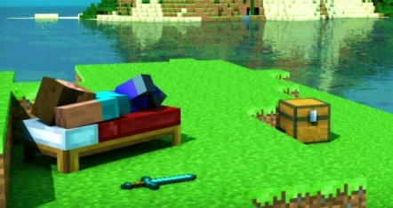
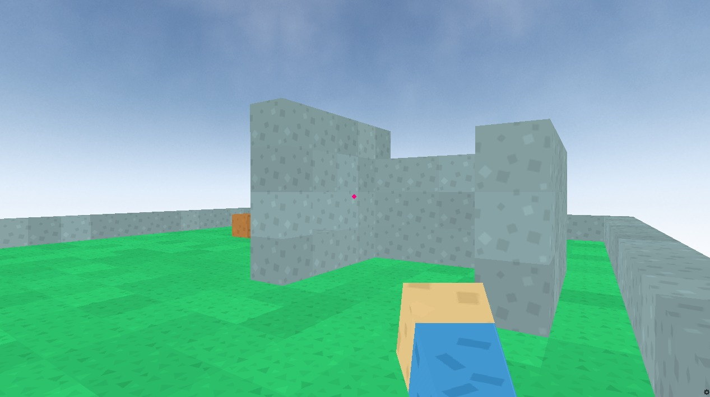
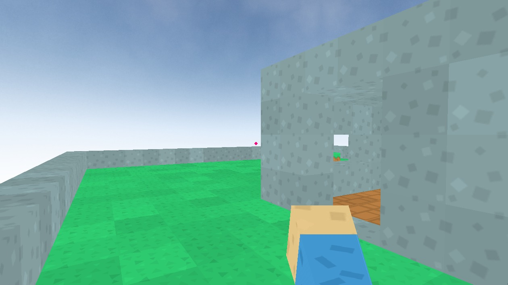

  

<h1 align="center">Minecraft em Python</h1> 

Apenas um clone do jogo Minecraft

Tabela de conteúdos
=================
<!--ts-->
   * [Sobre](#Sobre)
   * [Tabela de Conteudo](#tabela-de-conteudo)
   * [Demonstração](#Demonstração)
   * [Instalação](#Instalação)
   * [Como usar](#como-usar)
   * [Controles](#Controles)
      * [Pre Requisitos](#pre-requisitos)
   * [Tecnologias](#tecnologias)
   * [Referencia](#Referencia)
<!--te-->

<h4 align="center"> 
	✔️  Pronto  ✔️
</h4>

## Sobre

É uma aplicação que visa utilizar da linguagem de programação Python para criar uma copia do jogo Minecraft.

## Tabela de conteudo 

- [x] Teste da biblioteca
- [x] Jogo do Minecraft (python)
- [x] Texturas do jogo

## Demonstração 

Foto retirada do projeto em execução.

## Instalação 

Para instalar basta colocar em seu terminal o sequinte codigo:

<code>git clone https://github.com/Taunt-byte/Game-minecraft.git</code>

## Como usar 

Para utilizar basta executar o arquivo "Minecraft.py" em seu editor de texto que ele ira iniciar

## Controles 

+ W = Anda para frente
+ A = Anda para a esquerda
+ S = Anda para a direita
+ D = Anda para tras
+ Botão direito do Mause = Coloca bloco
+ Botão Esquerdo do Mause = Tira bloco
+ Para trocar o bloco do personagem basta usar os numeros de 1 a 4

## Pre Requisitos

Para aproveitar desse projeto você deve seguir os sequintes passos:

1) Primeiramente você deve possuir o git devidamente instalado em sua maquina

2) Depois do git você deve ter o python devidamente instalado em sua maquina junto com a biblioteca pygame

4) Você deve possuir a biblioteca Ursina do python para instalar basta digitar em seu terminal:

<code>pip install ursina</code>

ou

<code>git clone https://github.com/pokepetter/ursina.git</code>

<code>python setup.py develop</code>

Além disso,você pode querer (ou não) instalar dependencias opcionais e para isso basta que você escolha umas das dependencias abaixo,
ou instale-os todos com:

<code>pip install ursina [dependencia]</code>

<code>python -m pip install ursina</code>

### Dependencias

    • python 3.6+
    • panda3d
    • screeninfo, for detecting screen resolution
    • pillow, for texture manipulation
    • psutil, for measuring memory usage (optional)
    • hurry.filesize, for converting bytes to megabytes (optional)
    • imageio, for recording and converting to gifs (optional)
    • psd-tools3, for converting .psd files (optional)
    • blender, for converting .blend files (optional)

⚠️ As dependencias opcionais devem ser instaladas de forma manual ⚠️

3) E por ultimo deve possuir um bom editor de texto para a edição e execução do codigo (recomendo que use o VScode)

## Tecnologias

<table>
    <tr>
    <td>Python</td>
    </tr>
    <tr>
    <td>3.9.7</td>
    </tr>
</table>

## Referencia

Feito com base no video abaixo:

<code> https://www.youtube.com/watch?v=DHSRaVeQxIk </code>